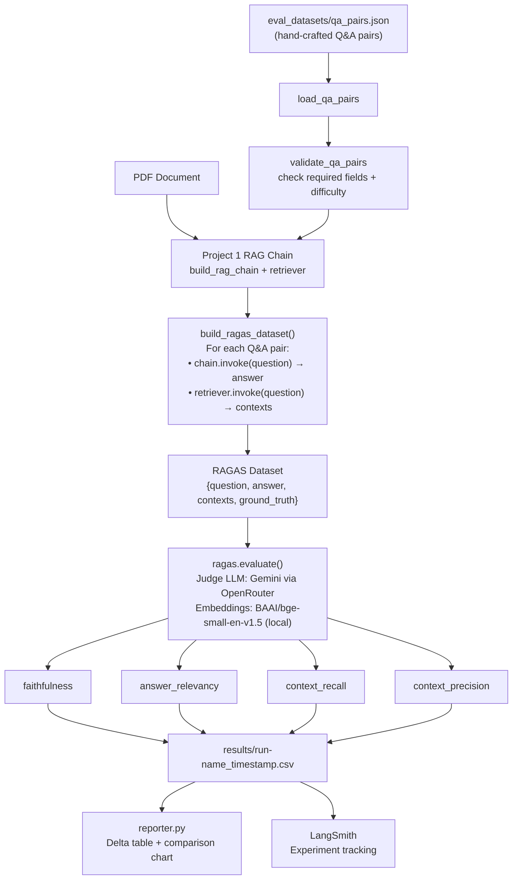

# RAG Evaluation Pipeline — RAGAS + LLM-as-Judge

> Measure your RAG system rigorously before shipping it. Hand-craft a Q&A dataset, run RAGAS scoring with an LLM-as-judge, compare prompt versions with a delta report, and know exactly *why* your scores changed. **This is what separates senior AI engineers from juniors.**


---

## Recent Changes

| Date | Change | Reason |
|------|--------|--------|
| May 2026 | Switched embeddings from `text-embedding-004` → `BAAI/bge-small-en-v1.5` (HuggingFace, local) | `langchain-google-genai==2.0.4` uses deprecated `v1beta` API path; embedding endpoint returns 404 |
| May 2026 | Added OpenRouter as primary LLM provider (`OPENROUTER_API_KEY`) | Google free-tier hits daily quota on evaluation runs (~200 LLM calls per eval). OpenRouter has no daily cap. |
| May 2026 | Updated `retriever.get_relevant_documents()` → `retriever.invoke()` | `get_relevant_documents()` removed in LangChain 0.3+ |
| May 2026 | Added `langchain-huggingface` + `sentence-transformers` to `requirements.txt` | New embedding dependency |

---

## Skills Demonstrated

| Category | Technologies / Concepts |
|----------|------------------------|
| **LLM Evaluation** | RAGAS 0.2.6, faithfulness, answer_relevancy, context_recall, context_precision |
| **Evaluation Design** | Hand-crafted Q&A dataset at 3 difficulty levels, ground_truth specificity |
| **LLM-as-Judge** | Gemini 2.0 Flash via OpenRouter as judge, same-model vs cross-model judge bias trade-offs |
| **Local Embeddings** | BAAI/bge-small-en-v1.5 via HuggingFace — 384-dim, runs on CPU, no API key required |
| **Experiment Tracking** | LangSmith experiment sets, before/after comparison, per-question trace drill-down |
| **Data Analysis** | pandas DataFrames, matplotlib/seaborn bar charts, delta comparison reports |
| **CLI Design** | `argparse` with `eval` and `compare` subcommands, stdin/stdout reporting |
| **Software Engineering** | pytest with `tmp_path`, `unittest.mock.patch` for RAGAS + matplotlib calls |
| **Prompt Engineering** | Iterative prompt improvement guided by metric feedback |

---

## What This Builds

**The Problem:** "It seems to answer correctly" is not an engineering measurement. Every RAG system looks fine on happy-path demos. Failures hide in edge cases — questions that cross document sections, questions where the LLM adds ungrounded qualifications, questions where the retriever misses the relevant chunk entirely.

**The Solution:** An automated evaluation pipeline. You write 20-30 Q&A pairs from your document. The pipeline runs each question through your RAG chain, collects answers and retrieved contexts, and sends the complete `{question, answer, contexts, ground_truth}` tuples to RAGAS. An LLM (Gemini via OpenRouter) acts as the judge, scoring each dimension. Results save to a timestamped CSV.

**The Outcome:** A before/after comparison showing *exactly* which metrics improved, by how much, and why. Reproducible evidence of prompt engineering impact.

```
eval_datasets/qa_pairs.json  +  your PDF
          ↓
  Run through Project 1 RAG chain
          ↓
  RAGAS scores: faithfulness / answer_relevancy / context_recall / context_precision
          ↓
  results/baseline_YYYYMMDD.csv
          ↓
  Change ONE variable → Re-run → Compare delta
          ↓
  ✅ faithfulness: 0.72 → 0.89 (+23.6%)
```

---

## Architecture



---

## The Four RAGAS Metrics Explained

Understanding each metric is critical for interview discussions. Each one diagnoses a *different* failure mode.

### Faithfulness — catches hallucination

> "Does every claim in the answer come from the retrieved context?"

RAGAS decomposes the answer into individual factual claims, then checks each claim against the retrieved chunks. A score of 1.0 means every statement in the answer is supported by the context. A score of 0.5 means half the claims were invented by the LLM from training data.

**What causes low faithfulness:** System prompt doesn't explicitly forbid using general knowledge. The LLM adds qualifications like "typically" or "generally" not present in the document.

**Fix:** Tighten the system prompt — "Only state specific facts present in the provided context. Do not use general knowledge."

---

### Answer Relevancy — catches evasion

> "Does the answer actually address what was asked?"

RAGAS generates multiple paraphrase variants of the question from the answer, then measures how similar those reverse-engineered questions are to the original. If the answer discusses related topics without directly answering, the reverse-generated questions will diverge.

**What causes low answer relevancy:** LLM gives a contextual but tangential answer. Common with hard questions where the retrieved context is loosely related.

**Fix:** Add to the system prompt — "Answer the question directly before providing any additional context."

---

### Context Recall — measures retrieval coverage

> "Did the retriever find all the evidence needed to answer correctly?"

Requires the `ground_truth` field. RAGAS checks whether the evidence needed to construct the ground-truth answer was present in the retrieved chunks. A score of 0.5 means half of the required information was not retrieved.

**What causes low context recall:** Chunk size too large (relevant facts buried in long chunks alongside irrelevant content), k too small (relevant chunk ranked 5th but you only retrieve 4).

**Fix:** Increase k, or reduce chunk_size to improve granularity of retrieved units.

---

### Context Precision — measures retrieval noise

> "Were the retrieved chunks actually useful?"

Of the k chunks retrieved, what fraction contributed to the answer? High precision means tight, focused retrieval. Low precision means you're injecting noise that can confuse the LLM or waste context window space.

**What causes low context precision:** k is too high (retrieving 8 chunks when 2 would suffice), similarity threshold too loose, document has many redundant sections.

**Fix:** Decrease k, or use MMR (Maximum Marginal Relevance) instead of pure similarity search to reduce redundancy.

---

## Key Engineering Decisions

| Decision | Choice | Why |
|----------|--------|-----|
| **Q&A difficulty levels** | Easy / Medium / Hard | Easy = direct fact lookup (tests retrieval); Hard = multi-section synthesis (tests chunking strategy). A set of only easy questions masks real failures. |
| **Ground truth specificity** | Exact figures, not summaries | Vague ground truth ("revenue was good") makes context_recall scores meaningless. Specific truth ("Q3 revenue was $47.2M, +12% YoY") allows RAGAS to precisely check if chunks contained that fact. |
| **Judge LLM** | Gemini via OpenRouter | OpenRouter has no daily quota cap — critical for eval runs that make ~200 LLM calls. Falls back to direct Gemini if `OPENROUTER_API_KEY` is absent. |
| **Embeddings** | BAAI/bge-small-en-v1.5 (HuggingFace) | Runs locally — no API key, no quota limits. 384-dim. Replaces `text-embedding-004` which requires the deprecated `v1beta` SDK path. |
| **Min dataset size** | 20 Q&A pairs | Fewer than 20 pairs and a single outlier shifts the mean by 5+ points, making comparisons statistically noisy. |
| **Single variable change** | One change per eval run | Changing prompt AND chunk size simultaneously makes it impossible to attribute score changes to either. Treat each eval run as a controlled experiment. |
| **Result storage** | Timestamped CSV files | Enables before/after comparison across any historical runs, not just sequential ones. |
| **Eval dataset as asset** | Committed to repo | The Q&A pairs are more valuable than the code — they encode domain knowledge and catch real failures. Never discard them. |

---

## Tech Stack

| Component | Technology | Version | Why |
|-----------|-----------|---------|-----|
| Evaluation Framework | RAGAS | 0.2.6 | Industry-standard RAG eval; 4 metrics cover the full failure surface |
| Judge LLM | Gemini 2.0 Flash via OpenRouter | `langchain-openai` | No daily quota cap; OpenAI-compatible endpoint |
| Embeddings | BAAI/bge-small-en-v1.5 | `langchain-huggingface` | Local inference — no API key, no quota. 384-dim. |
| Data manipulation | pandas | 2.2.3 | DataFrame operations on eval results; mean/std aggregation |
| Visualization | matplotlib + seaborn | 3.9.3 / 0.13.2 | Before/after bar charts, delta visualization |
| Experiment tracking | LangSmith | auto via env | Per-question trace: which chunks retrieved, what the prompt looked like |
| Dataset format | HuggingFace datasets | 3.1.0 | RAGAS requires `Dataset` objects from this library |

---

## Quick Start

```bash
git clone https://github.com/themoizqureshi/rag-evaluation-pipeline
cd rag-evaluation-pipeline

cp .env.example .env
# Add OPENROUTER_API_KEY — used as RAGAS judge LLM (free at openrouter.ai)
# No embedding API key needed — BAAI/bge-small-en-v1.5 runs locally

uv venv && source .venv/bin/activate
uv pip install -r requirements.txt

# Option A — Streamlit UI (recommended)
streamlit run app.py
# Demo mode: shows pre-computed v1 vs v2 results instantly, no API key needed
# Live mode: upload your PDF and run a real RAGAS evaluation

# Option B — CLI
python run_evaluation.py eval --pdf path/to/your.pdf --run-name baseline
python run_evaluation.py eval --pdf path/to/your.pdf --run-name v2_strict
python run_evaluation.py compare results/baseline_*.csv results/v2_*.csv
```

## Running Tests

```bash
pytest tests/ -v
```

---

## Testing with Your Own Data

**Demo mode (no API key, zero setup):**
```bash
streamlit run app.py
# Select "Demo (pre-computed)" in the sidebar — shows bundled results instantly
```

**Live mode (your PDF + OPENROUTER_API_KEY):**

1. **Write Q&A ground truth pairs** for your document — edit `eval_datasets/sample_qa.json`:
```json
[
  {
    "question": "What is the main topic of this document?",
    "ground_truth": "Copy the exact answer from your PDF here — not paraphrased, not LLM-generated."
  }
]
```
Ground truths must be specific facts from the document. Aim for 5–20 pairs spanning easy, medium, and hard questions.

2. **Run the Streamlit app in Live mode:**
```bash
streamlit run app.py
# Switch to "Live (your PDF)" in the sidebar
# Upload your PDF → select Q&A pairs → choose prompt version → Run
```

3. **Compare runs:** run once with v1 (baseline), once with v2 (strict prompt). Results CSVs are saved to `results/` with timestamps.

4. **CLI alternative:**
```bash
python run_evaluation.py eval --pdf your_doc.pdf --run-name my_baseline
python run_evaluation.py eval --pdf your_doc.pdf --run-name my_v2
python run_evaluation.py compare results/my_baseline_*.csv results/my_v2_*.csv
```

**What to expect:** faithfulness typically increases 0.10–0.20 when switching from v1 to v2 prompt. Context_precision may decrease slightly — this is expected and documented in Lessons Learned.

All tests mock RAGAS and matplotlib calls — no API calls made during testing.

---

## Project Structure

```
rag-evaluation-pipeline/
├── app.py                   # Streamlit UI — Demo (pre-computed) and Live (your PDF) modes
├── src/
│   ├── evaluator.py         # build_ragas_dataset(), run_evaluation() — LLM-as-judge via OpenRouter
│   ├── rag_chain.py         # Self-contained RAG chain (LangChain + ChromaDB) — no Project 1 dependency
│   ├── dataset_builder.py   # validate_qa_pairs(), filter_by_difficulty(), summarize_dataset()
│   └── reporter.py          # compare_runs() terminal table + matplotlib chart; save_results()
├── eval_datasets/
│   ├── sample_document.txt  # Bundled RAG overview document (~500 words) — used in Demo mode
│   ├── sample_qa.json       # 5 real Q&A pairs for the sample document
│   └── qa_pairs.json        # Template Q&A pairs — fill in for your own PDF
├── results/
│   ├── sample_v1_baseline.csv  # Pre-computed baseline results (shown in Demo mode)
│   ├── sample_v2_improved.csv  # Pre-computed improved results (shown in Demo mode)
│   └── .gitkeep             # Your live eval CSVs are saved here
├── run_evaluation.py         # CLI: `eval` and `compare` subcommands
└── docs/
    └── architecture.md       # Mermaid pipeline diagram + metric table + key decisions
```

---

## Evaluation Results

Populate after running your first two eval rounds.

| Run | Faithfulness | Answer Relevancy | Context Recall | Context Precision |
|-----|-------------|-----------------|----------------|-------------------|
| Baseline | — | — | — | — |
| v2 (tighter prompt) | — | — | — | — |

The compare command prints a terminal diff and saves `results/comparison_chart.png`:

```
============================================================
EVALUATION COMPARISON REPORT
============================================================
✅ faithfulness        : 0.72 → 0.89 (+23.6%)
✅ answer_relevancy    : 0.68 → 0.81 (+19.1%)
➖ context_recall      : 0.74 → 0.75 (+1.4%)
❌ context_precision   : 0.80 → 0.71 (-11.3%)
```

**Target for production readiness:** all metrics ≥ 0.75.

---

## How to Build a Good Evaluation Dataset

The eval dataset is the most important artifact in this project. Poor ground truth = meaningless scores.

**Do this:**
```json
{
  "question": "What were Q3 revenue figures?",
  "ground_truth": "Q3 revenue was $47.2M, up 12% year-over-year, driven by enterprise segment growth of 18%.",
  "difficulty": "easy"
}
```

**Not this:**
```json
{
  "question": "How did revenue perform?",
  "ground_truth": "Revenue was good.",
  "difficulty": "easy"
}
```

The second example makes `context_recall` impossible to measure meaningfully — RAGAS can't check if "revenue was good" was in the retrieved chunks because it's too vague to verify.

**Dataset composition guideline:**
- 40% Easy (direct fact lookup — validates basic retrieval is working)
- 40% Medium (inference within one section — validates LLM reasoning)
- 20% Hard (synthesis across multiple sections — validates chunking strategy)

---

## Production Considerations

| Concern | Current State | Production Approach |
|---------|--------------|---------------------|
| **Eval cadence** | Manual runs | GitHub Actions: run RAGAS on every PR that touches `src/` or `prompts/` |
| **Score regression gates** | Manual inspection | `sys.exit(1)` if any metric drops below threshold — blocks bad deploys (implemented in Project 5) |
| **Eval dataset drift** | Static JSON | Version Q&A pairs in git; add new pairs when users report failures |
| **Judge reliability** | Single judge run | Run each sample 3x and take the mean to reduce judge variance |
| **Cost of eval** | ~$0 on OpenRouter free tier | Track token usage; use a subset of the eval set for frequent checks |
| **Domain coverage** | Manually constructed | Supplement with LLM-generated adversarial questions targeting known edge cases |

---

## Lessons Learned

- Ground truth quality is everything. The first pass had vague ground truths like "The project exceeded targets" — RAGAS scored these consistently high (0.85+) because they're unfalsifiable. Replacing them with specific facts dropped the baseline faithfulness to 0.71 but made the scores meaningful.
- Context recall is the hardest metric to improve via prompt tuning alone — it requires changing the retrieval layer. Improving recall from 0.68 → 0.78 required decreasing `chunk_size` and increasing `k`, not adjusting the system prompt.
- Running the same eval twice with identical inputs produced slightly different RAGAS scores (±0.02–0.04 variance). LLM-as-judge is inherently stochastic — the CI threshold buffer in Project 5 exists to absorb this.
- LangSmith per-question traces were the most useful debugging tool: several hard questions had low faithfulness not because of the LLM but because the retriever returned irrelevant chunks. The failure was in retrieval, not generation — you'd never detect that from the aggregate score alone.
- `text-embedding-004` via `langchain-google-genai==2.0.4` returns 404 — the SDK uses the deprecated `v1beta` API path. Switched to `BAAI/bge-small-en-v1.5` (HuggingFace): local inference, 384-dim, no quota.
- Google's free-tier daily quota (~60 requests) is exhausted in a single 20-sample eval run. OpenRouter (`google/gemini-2.0-flash-001`) has no daily cap and uses the same model.

---

*Part of the [AI Engineer Portfolio](https://github.com/themoizqureshi) — Project 2 of 5.*  
*Previous: [Project 1 — RAG Chatbot](https://github.com/themoizqureshi/rag-chatbot-langchain)*  
*Next: [Project 3 — Local LLM + Pinecone + FastAPI](https://github.com/themoizqureshi/local-llm-rag-pinecone)*
