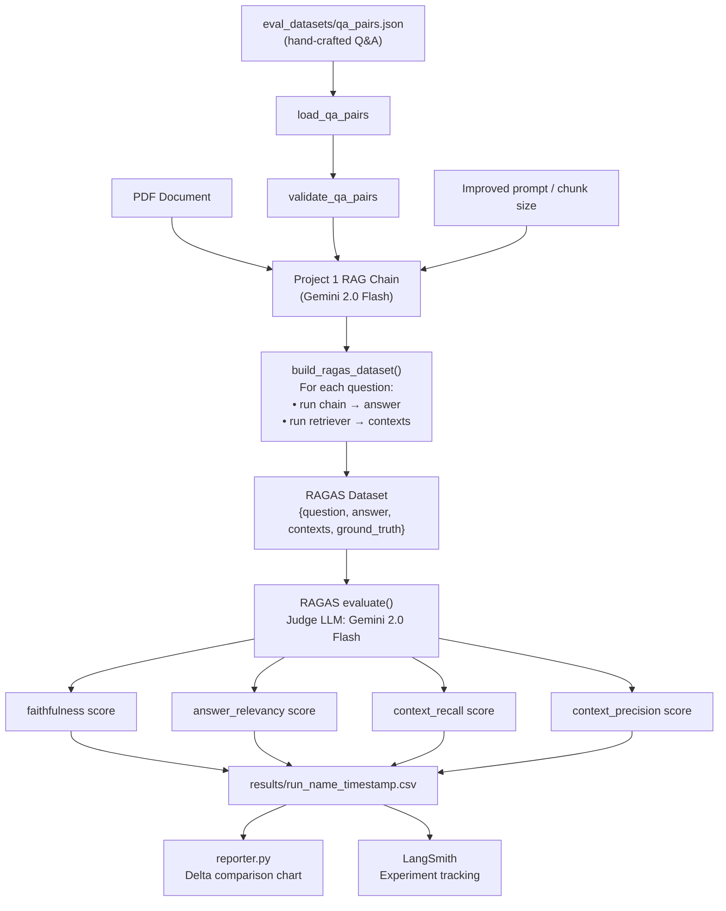

# Architecture — RAG Evaluation Pipeline

## Pipeline Overview



## What Each RAGAS Metric Measures

| Metric | Question it answers | What a low score means |
|--------|---------------------|------------------------|
| `faithfulness` | Is the answer supported by the retrieved context? | LLM is hallucinating — adding info not in chunks |
| `answer_relevancy` | Does the answer address the question? | LLM is giving evasive or off-topic answers |
| `context_recall` | Did retrieval find the chunks needed? | Wrong chunks retrieved — tune chunk size or k |
| `context_precision` | Are the retrieved chunks relevant? | Too much noise retrieved — reduce k or add filters |

## Eval Loop Workflow

```
1. Run baseline eval    →  results/baseline_YYYYMMDD.csv
2. Inspect low scores   →  Which metric failed? Which questions?
3. Change ONE variable  →  prompt, chunk_size, k, or model
4. Run improved eval    →  results/v2_YYYYMMDD.csv
5. Compare              →  python run_evaluation.py compare baseline.csv v2.csv
6. Repeat               →  Until all metrics ≥ 0.75
```

## Key Design Decisions

| Decision | Choice | Reason |
|----------|--------|--------|
| Judge LLM | Gemini 2.0 Flash | Free, handles RAGAS prompt format correctly |
| Embeddings | text-embedding-004 | Same as Project 1 — consistent embedding space |
| Min dataset size | 20 Q&A pairs | Statistical minimum for meaningful averages |
| Difficulty split | Easy / Medium / Hard | Hard questions (multi-section synthesis) expose real failures |
| Result storage | Timestamped CSVs | Enables before/after comparison across multiple runs |
